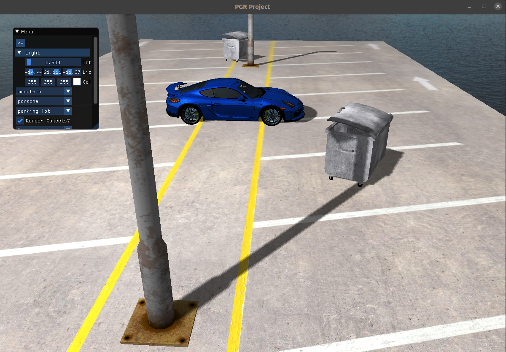

# PGR project

## Visualization of car models using OpenGL
For further info about the program please read info in the documentation file.

## Running the program
Before running the program, please download the resource models from this [link](https://drive.google.com/file/d/1DvoFTtIjb8tzNaZdCAEUU2CrXXCO3kOS/view?usp=sharing) and paste the data in the `res/` folder.

When you've done as instructed please run:
```
make
make run
```

## Previews from the program



